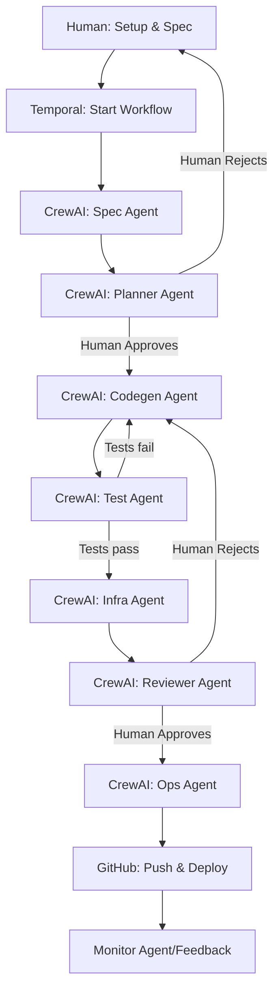

### Analysis

You want a **high-level plan** for a multi-agent, automated platform that:
- Uses **Temporal** for workflow orchestration
- Uses **CrewAI** for agent logic (LLM-powered agents)
- Uses **gcp-tools-cdktf** for IaC (GCP infra)
- Uses **gcp-tools-mcp** for project/bootstrap automation and as a helper for CDKTF
- Deploys by pushing to GitHub (triggering CI/CD)
- **Human** sets up the initial environment and spec, then the platform takes over

You’re asking if more info is needed before a high-level plan.  
**Short answer:** I have enough to draft a high-level plan, but will note where more detail would help for a detailed design.

---

## **High-Level Plan: Multi-Agent GCP Service Platform**

### **1. Human Bootstrapping Phase**

- **Setup:**  
  Human uses `gcp-tools-mcp` to:
  - Create GCP projects (host, app, data) with correct org/billing.
  - Set up GitHub repo (with secrets, envs, etc.).
  - Optionally, generate skeleton app/IaC structure.

- **Configure Platform:**  
  Human configures the new gcp-tools-agent platform to use the new projects and repo.

- **Write Initial Spec:**  
  Human writes a brief/spec (e.g., `docs/brief.md`) describing the desired service/workflow.

---

### **2. Automated Multi-Agent Workflow (Temporal Orchestrated, CrewAI Agents)**

#### **A. Temporal Workflow Steps**

1. **Spec Agent**  
   - Reads the spec, extracts requirements.

2. **Planner Agent**  
   - Proposes architecture, API, data models, test strategy.
   - **Human-in-the-loop:**  
     - Human reviews and approves/edits the plan before proceeding.

3. **Codegen Agent**  
   - Generates code (handlers, IO, transforms, types, etc.).

4. **Test Agent**  
   - Writes and runs tests, reports results.
   - If tests fail, returns to Codegen Agent for fixes.

5. **Infra Agent**  
   - Generates/updates IaC using `gcp-tools-cdktf` (multi-project aware).
   - Uses `gcp-tools-mcp` for project/secret automation as needed.

6. **Reviewer Agent**  
   - Reviews code for style, correctness, and best practices.
   - **Human-in-the-loop:**  
     - Human reviews and approves/edits the review before proceeding.
   - If review fails, returns to Codegen Agent for fixes.

7. **Ops Agent**  
   - Pushes changes to GitHub (triggers CI/CD).
   - Monitors deployment status.

---

#### **B. Artifact Storage**

- All generated code, docs, and IaC are committed/pushed to GitHub.
- GitHub is the single source of truth for artifacts.

---

#### **C. Multi-Project Architecture**

- Infra Agent and Codegen Agent are aware of the three-project split (host, app, data).
- Follows the patterns from `gcp-tools-cdktf` and the example app.
- IaC and service code are organized into the correct subdirectories and projects.

---

#### **D. Human-in-the-Loop Gates**

- **After Planning:**  
  Human must approve or edit the plan before codegen starts.
- **After Review:**  
  Human must approve or edit the review before deployment.

---

#### **E. (To Be Determined Later)**

- **Secrets/Credentials:**  
  Will revisit, but can leverage `gcp-tools-mcp` for automation.
- **Notifications/Feedback:**  
  Will revisit, but can be added as a Temporal activity or via GitHub/Slack/etc.

---

### **3. Deployment & Monitoring**

- **Deployment:**  
  Ops Agent pushes to GitHub, triggering CI/CD (GitHub Actions) for build, test, and deploy to GCP.
- **Monitoring:**  
  Ops Agent (or a future Monitor Agent) checks deployment status and reports back.

---

### **4. Workflow Diagram (Updated)**

---

## **Next Steps**

- If you want, I can break down:
  - Example Temporal workflow code structure
  - CrewAI agent definitions and handoff
  - How to structure the multi-project IaC/codegen
  - Integration points for human approval (UI, CLI, or GitHub PR comments)
- Or, we can dive into any specific part (e.g., agent implementation, Temporal workflow, IaC patterns).

**Let me know which part you want to detail next, or if you want a concrete prototype for any phase!**