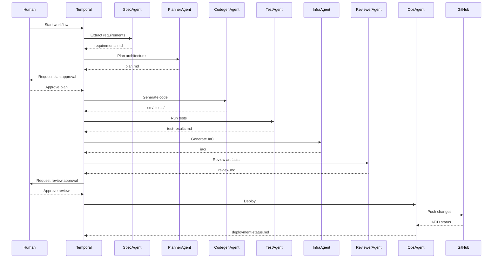
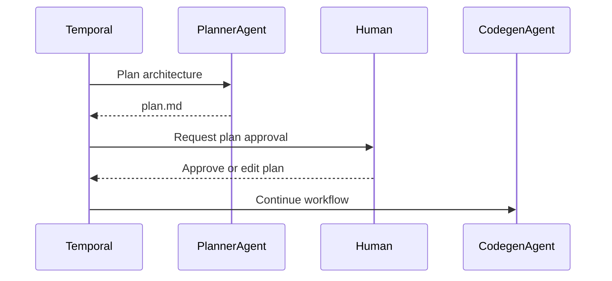

# Sequence Diagrams

## Overview
This document provides Mermaid sequence diagrams for key flows in the multi-agent workflow, including human-in-the-loop pauses.

---

## 1. End-to-End Workflow

---

## 2. Human-in-the-Loop Pause Example

